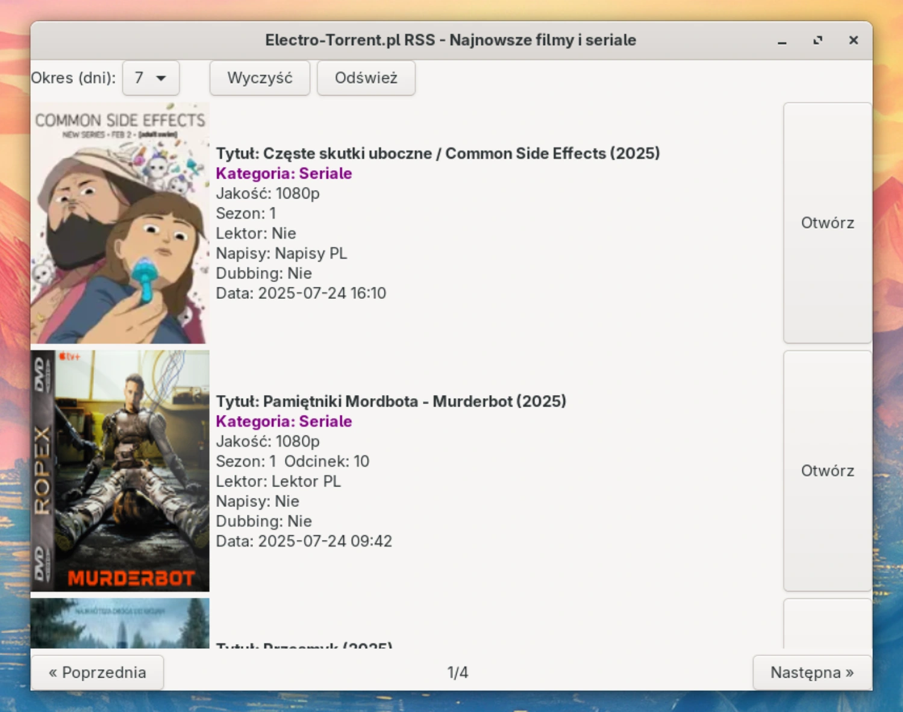

# Electro-RSS
Skrypt do listowania najnowszych materiałów z electro-torrent.pl za pomocą RSS.

Jestem leniwy i nie chce mi się przeglądać całej strony w poszukiwaniu materiałów z 2024 i 2025, a tylko takie mnie interesują.
Jeśli też jesteś leniwy jak ja, możesz użyć tego skryptu, aby wylistować ostatnio dodane torrenty.

Ten skrypt to nic innego jak tylko parser kanału RSS i wyświetlanie go w formie, która mnie zadowala.



## Wymagania
- **Python 3.x**
- **GTK 3** + **PyGObject**
- **feedparser** (pip)
- **requests** (pip)

## Instalacja Debian/Ubuntu:
```
sudo apt install python3 python3-gi python3-gi-cairo gir1.2-gtk-3.0 gir1.2-gdkpixbuf-2.0 python3-pip
pip3 install requests feedparser
```
## Instalacja Fedora
```
sudo dnf install python3 python3-gobject gtk3 gdk-pixbuf2 python3-pip
pip3 install requests feedparser
```
## Instalacja Arch
```
sudo pacman -S python gobject-introspection gtk3 gdk-pixbuf2 python-requests python-feedparser
```

## Uruchamianie
Pobierz plik electro-rss.py i uruchom go komendą:
```
python electro-rss.py
```
